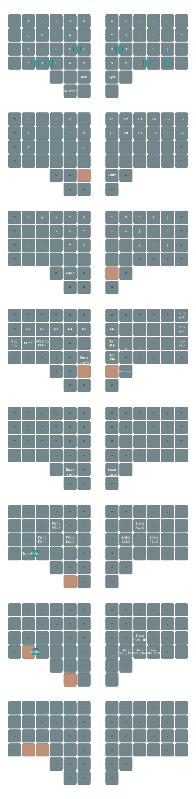

# ZMK Configuration

ZMK configuration for [charybdis](https://github.com/Bastardkb/Charybdis/tree/main) wireless
version with [nice!nano](https://nicekeyboards.com/nice-nano/).

## Ergonomic defaults

The base layer keeps the pointer and scroll layers on the left lower thumb
keys, so they can be held while operating the right-hand trackball. The left
thumb cluster provides **Shift**, **Num**, and **Space**; the right thumb
cluster provides **Sym** and **Enter**. Right Control is on the remaining
right thumb key for common editor shortcuts.

## Keymap

## Layer and shortcut guide

Layer keys are momentary unless noted otherwise: hold the listed key while
pressing another key.

| Layer | How to activate | Highlights |
| --- | --- | --- |
| **Num** | Hold the left **Num** thumb key | Numbers, symbols, brackets, and F1–F12 |
| **Sym** | Hold the right **Sym** thumb key | Arrows, Home/End, Page Up/Down, Insert/Delete, Tab/Shift-Tab, and quotes |
| **Func** | Hold **Num + Sym** together | Bluetooth, USB, media, RGB, function keys, Caps Lock, Game, and Studio controls |
| **Pointer** | Hold the lower-left **Pointer** thumb key | Left/middle/right click, arrow keys, and access to Snipe or Scroll |
| **Scroll** | Hold the lower-left **Scroll** thumb key, or hold **Pointer + X** | The trackball and directional keys scroll horizontally and vertically at reduced speed |
| **Snipe** | Hold **Pointer + Z** | Precision trackball movement and arrow keys |
| **Game** | Hold **Func**, then tap **B** | Locks the gaming layer on; tap either the **Num** or **Sym** thumb key to return to Base |

### Function, Bluetooth, and media shortcuts

| Action | Combination |
| --- | --- |
| Use Bluetooth output | **Func + H** |
| Select Bluetooth profile 0 | **Func + J** |
| Select Bluetooth profile 1 | **Func + K** |
| Use USB output | **Func + N** |
| Caps Lock | **Func + G** |
| Mute | **Func + A** |
| Volume down | **Func + S** |
| Volume up | **Func + D** |
| F1–F10 | **Func + Q–P** |
| F11 | **Func + ;** |
| F12 | **Func + /** |

Select an unused Bluetooth profile before pairing a new host. Selecting a
profile switches hosts; it does not clear an existing bond.

### RGB underglow

| Action | Combination |
| --- | --- |
| Toggle underglow | **Func + Left Control** |
| Next effect (Solid → Breathe → Spectrum → Swirl) | **Func + Backspace** |
| Increase brightness | **Func + Backslash** |
| Decrease brightness | **Func + Apostrophe** |

### Pointer controls and key combos

The trackball normally moves the pointer. While holding **Pointer**, use
**J/I/L** for left/middle/right click. On the **Pointer** and **Snipe** layers,
**K/M/Comma/Period** act as Up/Left/Down/Right. On the **Scroll** layer, those
same keys scroll Up/Left/Down/Right instead.

These two-key combos can be pressed simultaneously without holding a layer:

| Keys | Result |
| --- | --- |
| **Z + X** | Left Shift |
| **X + C** | Left Alt/Option |
| **F + G** | Left Control |
| **H + J** | Right Control |
| **Comma + Period** | Left Alt/Option |

## ZMK Studio

ZMK Studio is enabled for both the right-half central and dongle firmware
builds. Connect whichever one is acting as the central device over USB. Studio
locking is disabled, so Studio can edit the keymap immediately without an
unlock key combination.
